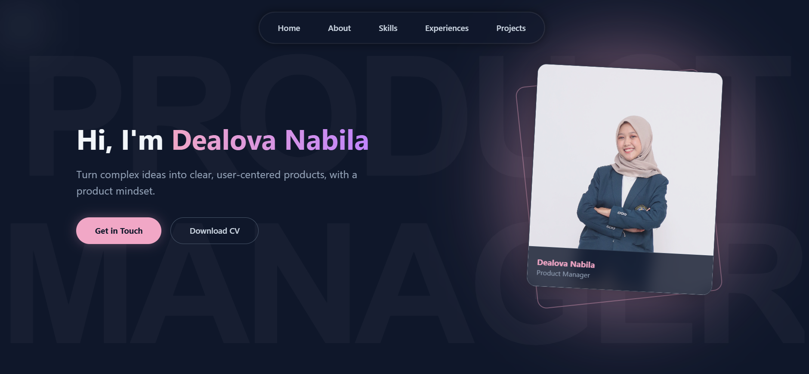

<p align="center">
  
  &nbsp;&nbsp;&nbsp;&nbsp; 
</p>

## Personal Website v1 🌐✨

A modern and responsive personal website showcasing professional portfolio, skills, and projects. Built with clean design principles and optimized for performance across all devices.

## 🚀 Features

- **📱 Fully Responsive** - Optimized for all devices and screen sizes
- **🎨 Modern UI/UX** - Clean and professional design with smooth animations
- **💼 Portfolio Showcase** - Dedicated section to display projects and work samples
- **👤 About Section** - Personal introduction and professional background
- **⏰ Experience Timeline** - Professional work experience and career journey
- **🛠️ Skills Display** - Visual representation of technical skills and expertise
- **📧 Contact Form** - Interactive contact form for professional inquiries
- **⚡ Fast Loading** - Optimized for quick loading times and better user experience
- **🔍 SEO Friendly** - Structured markup for better search engine visibility

## 🛠️ Tech Stack


- **Framework**: 
- **Language**: 
- **UI Library**: 
- **Styling**: 
- **UI Components**: 
- **Animations**: 
- **Icons**: 
- **Version Control**: 
- **Deployment**: 

## 📁 Project Structure

```
PERSONALSITE-V1/
├── public/
│   └── assets/              # Static assets
└── src/
    ├── components/
    │   ├── layout/          # Layout components
    │   ├── sections/        # Page sections (CURRENTLY IN src/sections)
    │   └── ui/              # Shadcn UI components
    └── lib/                 # Utility functions
```


## 👨‍💻 Author

**Dealova Nabila**
- GitHub: [dvsalmah](https://github.com/dvsalmah)
- LinkedIn: [dealova-ns](https://linkedin.com/in/dealova-ns)
- Website: [dealovaa-site.vercel.app](https://dealovaa-site.vercel.app)
